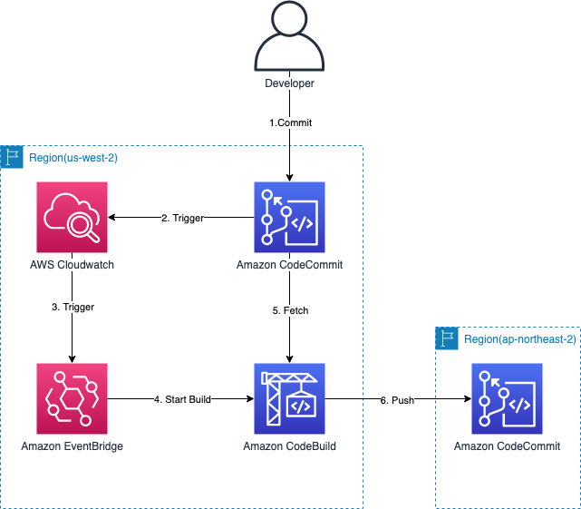

# PicaPica - Replicate Cross Regional CodeCommits

This repository is for replicating codecommits across regions on same account



> Running this repository may cost you to provision AWS resources

# Prerequisites

- Nodejs 10.x
- AWS Account and Locally configured AWS credential

# Installation

Install project dependencies

```bash
$ npm i -g cdk@1.67.0
$ npm i
$ cdk bootstrap
```

# Usage

## Setup config

Fill [**lib/interfaces/config.ts**](lib/interfaces/config.ts)

```bash
$ vim lib/interfaces/config.ts
```

In order to check out your **Account** run below,

```bash
$ aws sts get-caller-identity
{
  "UserId": ...
  "Account": "000000000000",
  "Arn": ...
}
```

Set **Region** to the region your source codecommit repository is placed.

## Deploy CDK Stacks on AWS

> YOU SHOULD DEPLOY THIS CDK PROJECT ON THE **SOURCE REGION**
> use profile or something

```bash
$ cdk deploy "*" --require-approval never
```

Done!

Commit & push some code to source-repository and
visit **CodeBuild Project** console to check out build progress.

# Cleanup

destroy provisioned cloud resources

```bash
$ cdk destroy "*"
```
